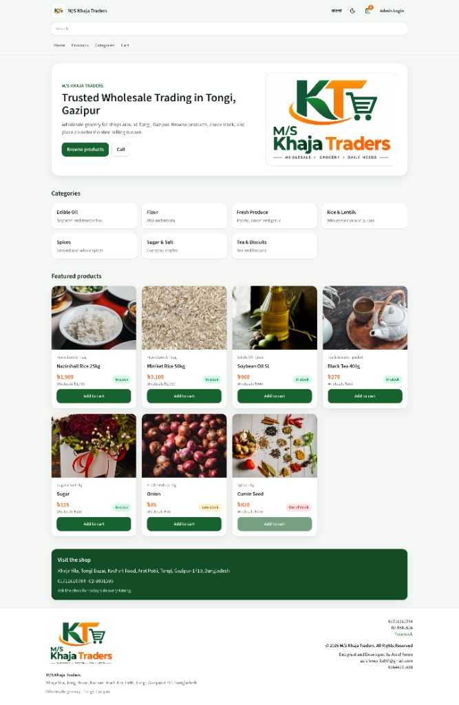
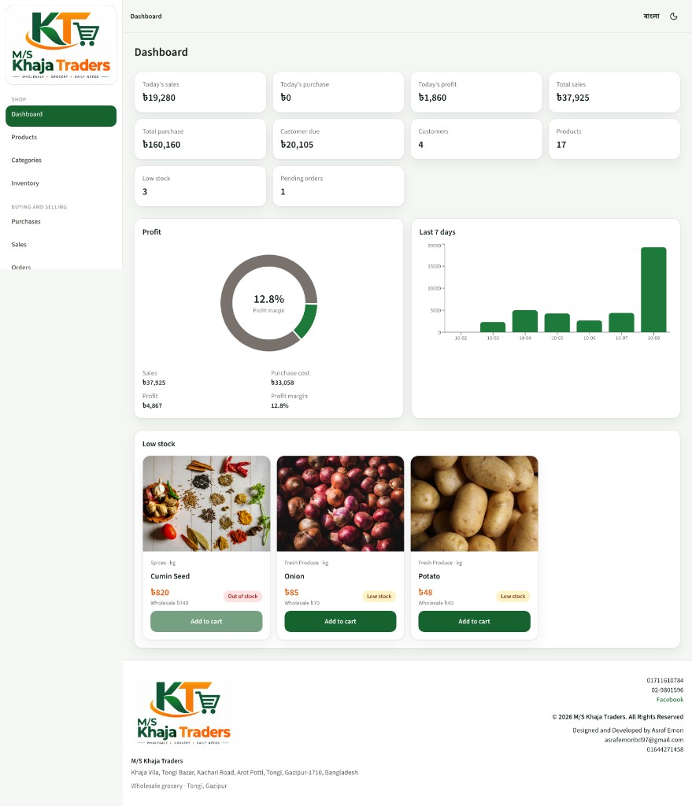

# M/S Khaja Traders

Wholesale grocery storefront and shop office for **M/S Khaja Traders**, Tongi, Gazipur. Customers browse products in English or Bangla, place an order, and pay with bKash, Nagad, Rocket, bank transfer, or card. Staff run stock, sales, purchases, and the accounts book from the same site.

**Live site:** https://m-s-khaja-traders-ui.vercel.app

The API lives in a separate repository: [m-s-khaja-traders-backend](https://github.com/asraf-emon/m-s-khaja-traders-backend).

## Screenshots

### Storefront



### Dashboard



## What it includes

**Shop**

- Home, product catalog, categories, and product details
- Cart and checkout
- bKash, Nagad, and Rocket with the shop QR and a transaction ID
- Bank transfer details and card checkout through Stripe
- English and Bangla

**Office**

- Dashboard for today’s sales, profit, customer due, and low stock
- Products, categories, and inventory history
- Purchases, sales, orders, customers, and suppliers
- Accounts book, expenses, payments, and reports
- Staff management for admins, plus audit log and shop settings
- PDF download for lists and records

## Tech

Next.js, React, TypeScript, and Tailwind CSS. Sign-in uses Firebase. The browser talks to the Express API; it does not connect to the database itself.

## Run it locally

Use Node.js 20 or newer and pnpm.

```bash
pnpm install
cp .env.example .env.local
pnpm dev
```

Open http://localhost:3000. The API should already be running at http://localhost:5001.

| Variable | Purpose |
|---|---|
| `NEXT_PUBLIC_API_URL` | API origin, with no `/api` suffix |
| `NEXT_PUBLIC_FIREBASE_API_KEY` | Firebase web config |
| `NEXT_PUBLIC_FIREBASE_AUTH_DOMAIN` | Firebase web config |
| `NEXT_PUBLIC_FIREBASE_PROJECT_ID` | Firebase web config |
| `NEXT_PUBLIC_FIREBASE_STORAGE_BUCKET` | Firebase web config |
| `NEXT_PUBLIC_FIREBASE_MESSAGING_SENDER_ID` | Firebase web config |
| `NEXT_PUBLIC_FIREBASE_APP_ID` | Firebase web config |
| `NEXT_PUBLIC_STRIPE_PUBLISHABLE_KEY` | Optional. Card checkout uses a Stripe Checkout redirect |

On Vercel, set `NEXT_PUBLIC_API_URL` to `https://khaja-traders-api.onrender.com` before the production build. `NEXT_PUBLIC_*` values are baked in at build time.
